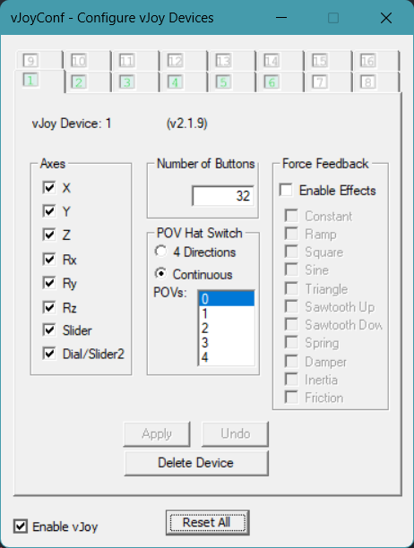

## 手柄配置说明

<div style="background: #fff8e6; padding: 12px; border-left: 4px solid #ffcc00; margin-bottom: 20px;">
⚠️ <strong>注意：仅在使用手柄功能时需要配置，不使用手柄可跳过此步骤</strong>
</div>

### 安装与配置流程

1. **安装驱动**  
   - 安装vJoy的时候电脑不要连接手柄
   - 双击 `Joy` 目录下的 `vJoySetup.exe`  
   - 如安装失败，请重新尝试安装

2. **配置手柄**  
   - 打开开始菜单（Win键）搜索 `vJoy`  
   - 选择 **Configure vJoy**（或直接运行 `vJoyConf.exe`）  
    

    
   
   *图示：vJoy配置工具界面*

3. **参数设置**  
   - 在配置界面中找到 `Number of Buttons`  
   - 将数值修改为 `32`  
   - 点击 `Apply` 保存设置  
   ```diff
   + 重要：必须确保数值准确修改为32！
4. **串联多线程配置**  
   - ⚠️ <strong>注意：不开启串联多线程功能，跳过此步骤</strong>
   - 串联多线程时需要用到多个vjoy手柄
   - 添加6个（主线程一个，多线程5个）vjoy手柄

    

    

   *图示：vJoy配置工具界面*

### 解决手柄宏被屏蔽问题

1. **RMT虚拟手柄转Xbox手柄**  
   - 运行Joy目录下的XOutput.exe
   - 【RMT虚拟手柄转Xbox手柄】点击开始即可
2. **按键映射**
   - 【RMT虚拟手柄转Xbox手柄】点击编辑
   - 手柄按键右边点击配置即可重新设置映射按钮
3. **vjoy按键设置映射**
   - RMT编辑一个点击Joy1按键的宏
   - 配置时触发这个宏，就可以把Joy1按键映射成对应的xbox按键
4. **保存配置**
   - 未保存配置，重新打开XOutput配置会重置

### 卸载流程
1. **删除vJoy**
   - 执行C:\Program Files\vJoy\unins000.exe即可